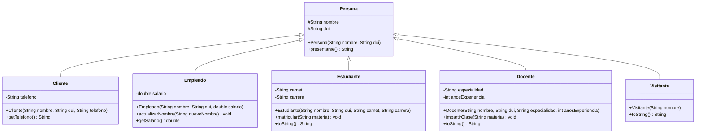

# Diagrama de Clases - Semana 5

```mermaid
classDiagram
    class Persona {
        #String nombre
        #String dui
        +Persona(String nombre, String dui)
        +presentarse() String
    }

    class Cliente {
        -String telefono
        +Cliente(String nombre, String dui, String telefono)
        +getTelefono() String
    }

    class Empleado {
        -double salario
        +Empleado(String nombre, String dui, double salario)
        +actualizarNombre(String nuevoNombre) void
        +getSalario() double
    }

    class Estudiante {
        -String carnet
        -String carrera
        +Estudiante(String nombre, String dui, String carnet, String carrera)
        +matricular(String materia) void
        +toString() String
    }

    class Docente {
        -String especialidad
        -int anosExperiencia
        +Docente(String nombre, String dui, String especialidad, int anosExperiencia)
        +impartirClase(String materia) void
        +toString() String
    }

    class Visitante {
        +Visitante(String nombre)
        +toString() String
    }

    Persona <|-- Cliente
    Persona <|-- Empleado
    Persona <|-- Estudiante
    Persona <|-- Docente
    Persona <|-- Visitante
```